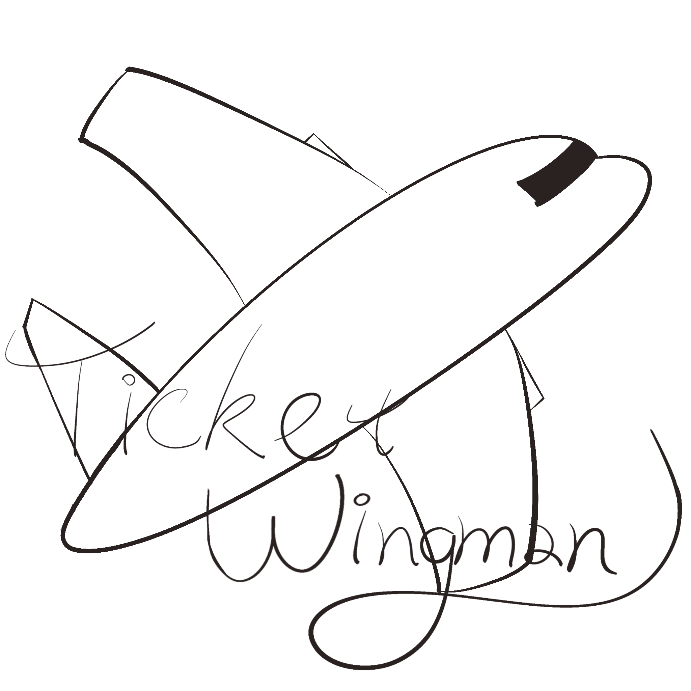

<!-- Improved compatibility of back to top link: See: https://github.com/othneildrew/Best-README-Template/pull/73 -->

<a name="readme-top"></a>

<!--
*** Thanks for checking out the Best-README-Template. If you have a suggestion
*** that would make this better, please fork the repo and create a pull request
*** or simply open an issue with the tag "enhancement".
*** Don't forget to give the project a star!
*** Thanks again! Now go create something AMAZING! :D
-->

<!-- PROJECT SHIELDS -->
<!--
*** I'm using markdown "reference style" links for readability.
*** Reference links are enclosed in brackets [ ] instead of parentheses ( ).
*** See the bottom of this document for the declaration of the reference variables
*** for contributors-url, forks-url, etc. This is an optional, concise syntax you may use.
*** https://www.markdownguide.org/basic-syntax/#reference-style-links
-->

[![Contributors][contributors-shield]][contributors-url]
[![Issues][issues-shield]][issues-url]
[![MIT License][license-shield]][license-url]

<!-- PROJECT LOGO -->
<br />
<div align="center">
  <a href="https://github.com/github_username/repo_name">
    
  </a>

<h3 align="center">Ticket Wingman</h3>

  <p align="center">
    A flight search app that aims to simplify the process of booking flights and planning trips.
    <br />
    <a href="https://github.com/github_username/repo_name">View Demo</a>

  </p>
</div>

<!-- TABLE OF CONTENTS -->
<details>
  <summary>Table of Contents</summary>
  <ol>
    <li>
      <a href="#about-the-project">About Ticket Wingman</a>
      <ul>
        <li><a href="#built-with">Built With</a></li>
        <li><a href="#api-documentations">Api Documentations</a></li>
        <li><a href="#features">Features</a></li>
      </ul>
    </li>
    <li>
      <a href="#getting-started">Getting Started</a>
      <ul>
        <li><a href="#prerequisites">Prerequisites</a></li>
        <li><a href="#installation">Installation</a></li>
      </ul>
    </li>
    <li><a href="#usage">Usage</a></li>
    <li><a href="#contributing">Contributing</a></li>
    <li><a href="#license">License</a></li>
    <li><a href="#contact">Contact</a></li>
    <li><a href="#acknowledgments">Acknowledgments</a></li>
  </ol>
</details>

<!-- ABOUT THE PROJECT -->

## About Ticket Wingman

Ticket Wingman is a web application that allows users to look up flight details, carbon dioxide emissions, destination travel awareness, past-year weather and rainfall records, supported plug types at the destination, and real-time flight status tracking. It provides an easy-to-use interface, and is built using modern web technologies and APIs to ensure a smooth and efficient user experience.

<p align="right">(<a href="#readme-top">back to top</a>)</p>

### Built With

- [![React][React.js]][React-url]
- [![Redux][Redux.js]][Redux-url]
- [![Bootstrap][Bootstrap.com]][Bootstrap-url]
- [![Chart][Chart.js]][ChartJs-url]

### API Documentations

- https://www.travel-advisory.info/data-api
- https://open-meteo.com
- https://aviationstack.com/documentation
- https://www.epa.gov/energy/greenhouse-gas-equivalencies-calculator

### Features

- [ ] Search for a flight and get information such as price, duration, emissions, etc
- [ ] Daily updated country advisories for searched destination
- [ ] Historical weather and rainfall chart for searched destination
- [ ] Types of available plugs in the searched destination
- [ ] Visualize carbon dioxide emission with real-life examples
- [ ] Real-time tracked information of your flight
- [ ] Save information about a specific flight on Ticket Wingman account
- [ ] Information on popular travel destinations
- [ ] Google and GitHub OAuth

<p align="right">(<a href="#readme-top">back to top</a>)</p>

<!-- GETTING STARTED -->

## Getting Started

To get a local copy up and running follow these simple example steps:

### Prerequisites

Install Node.js and npm: Node.js comes with npm (Node Package Manager), so you don't need to install npm separately.

- Node.js and npm
  ```sh
  npm install -g npm
  ```

### Installation

1. Clone the repo
   ```sh
   git clone https://github.com/9Mohamedismail/TicketWingman.git
   ```
2. Navigate to the Project Directory
   ```sh
   cd TicketWingman
   ```
3. Install npm packages
   ```sh
   npm install
   ```
4. Start the Application
   ```sh
   npm start
   ```
5. Access the Application:
   Once the application has started successfully, you can access it in your web browser by visiting http://localhost:3000 (or a different port if specified in the project).

<p align="right">(<a href="#readme-top">back to top</a>)</p>

<!-- USAGE EXAMPLES -->

## Usage

Use this space to show useful examples of how a project can be used. Additional screenshots, code examples and demos work well in this space. You may also link to more resources.

_For more examples, please refer to the [Documentation](https://example.com)_

<p align="right">(<a href="#readme-top">back to top</a>)</p>

<!-- CONTRIBUTING -->

## Contributing

Contributions are what make the open source community such an amazing place to learn, inspire, and create. Any contributions you make are **greatly appreciated**.

If you have a suggestion that would make this better, please fork the repo and create a pull request. You can also simply open an issue with the tag "enhancement".
Don't forget to give the project a star! Thanks again!

1. Fork the Project
2. Create your Feature Branch (`git checkout -b feature/AmazingFeature`)
3. Commit your Changes (`git commit -m 'Add some AmazingFeature'`)
4. Push to the Branch (`git push origin feature/AmazingFeature`)
5. Open a Pull Request

<p align="right">(<a href="#readme-top">back to top</a>)</p>

<!-- LICENSE -->

## License

Distributed under the MIT License. See `LICENSE.txt` for more information.

<p align="right">(<a href="#readme-top">back to top</a>)</p>

<!-- CONTACT -->

## Contact

Your Name - [@twitter_handle](https://twitter.com/twitter_handle) - email@email_client.com

Project Link: [https://github.com/github_username/repo_name](https://github.com/github_username/repo_name)

<p align="right">(<a href="#readme-top">back to top</a>)</p>

<!-- ACKNOWLEDGMENTS -->

## Acknowledgments

- []()
- []()
- []()

<p align="right">(<a href="#readme-top">back to top</a>)</p>

<!-- MARKDOWN LINKS & IMAGES -->
<!-- https://www.markdownguide.org/basic-syntax/#reference-style-links -->

[contributors-shield]: https://img.shields.io/badge/contributors-4-green?style=for-the-badge
[contributors-url]: https://github.com/9Mohamedismail/TicketWingman/graphs/contributors
[issues-shield]: https://img.shields.io/github/issues/github_username/repo_name.svg?style=for-the-badge
[issues-url]: https://github.com/github_username/repo_name/issues
[license-shield]: https://img.shields.io/github/license/github_username/repo_name.svg?style=for-the-badge
[license-url]: https://github.com/github_username/repo_name/blob/master/LICENSE.txt
[product-screenshot]: images/screenshot.png
[React.js]: https://img.shields.io/badge/React-20232A?style=for-the-badge&logo=react&logoColor=61DAFB
[React-url]: https://reactjs.org/
[Redux.js]: https://img.shields.io/badge/redux.js-000000?style=for-the-badge&logo=redux&logoColor=%23764ABC&color=%23282828
[Redux-url]: https://redux.js.org/
[Chart.js]: https://img.shields.io/badge/chart.js-000000?style=for-the-badge&logo=chartdotjs&logoColor=%23FF6384&color=%23eee
[ChartJs-url]: https://www.chartjs.org/
[Bootstrap.com]: https://img.shields.io/badge/Bootstrap-563D7C?style=for-the-badge&logo=bootstrap&logoColor=white
[Bootstrap-url]: https://getbootstrap.com
